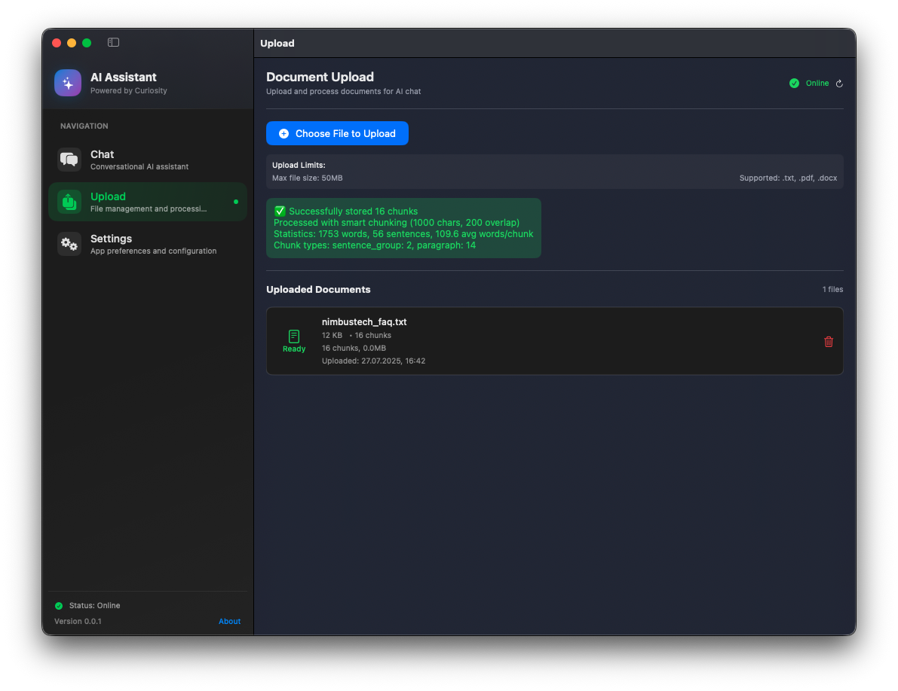
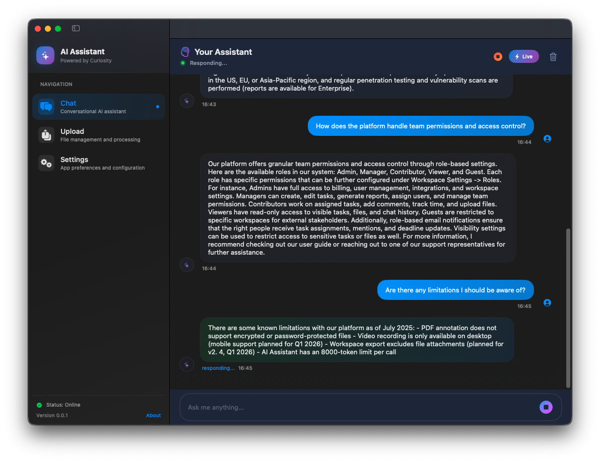

# EasyRAG - No-Code RAG Backend with macOS Demo App

This is my open-source side project, EasyRAG, where I'm building a highly customizable, no-code Retrieval-Augmented Generation (RAG) system tailored for small enterprises. My primary goal is to create a robust chatbot backend that can serve as a foundation for applications like call center automation. The macOS SwiftUI app included is a demo to showcase the backend's capabilities, not the main focus of the project. I plan to expand this project as time and new technologies allow.

## Project Overview

EasyRAG combines a powerful FastAPI backend with a demo macOS app. The backend handles document ingestion, smart chunking, vector embeddings, and AI responses using local language models via Ollama and semantic search with ChromaDB. The macOS app demonstrates the workflow by allowing document uploads and chat interactions.

### Key Features
- Upload .pdf, .docx, and .txt documents
- Context-aware chat responses using a local LLM (Mistral via Ollama)
- Smart chunking with paragraph, sentence, or overflow logic
- Duplicate detection using SHA-256 content hashes
- Metadata tracking and file deletion support
- Extensible for call centers, web UIs, STT/TTS, and more

## Backend Setup (Required First)

The macOS demo app requires the FastAPI backend to be running to function. You must set up and start the backend before using the app.

### Prerequisites
- Python 3.10 or later
- macOS or Linux (WSL2 supported)
- Ollama installed
- Mistral model: `ollama pull mistral`

### Install and Run Backend
```bash
cd backend
python3 -m venv .venv
source .venv/bin/activate
pip install -r requirements.txt
ollama pull mistral
uvicorn app.main:app --reload --host 127.0.0.1 --port 8000
```

Ensure the backend is running before launching the macOS app. The default backend URL is `http://127.0.0.1:8000`.

## macOS Demo App (SwiftUI)

The macOS app is a demonstration tool to show how the backend works. It lets you upload documents, view metadata, delete files, and chat with the AI assistant using document context. The backend must be running for these features to work.

### App Screenshots

#### File Upload UI
The Upload tab allows you to select and upload .pdf, .docx, or .txt files to the backend. It also displays uploaded file metadata and provides options to delete files.


- Features file picker
- Shows file metadata (name, size, upload date)
- Includes a delete button for each file

#### Chat UI
The Chat tab provides a conversational interface to interact with the AI assistant, using context from uploaded documents.


- Displays user messages and AI responses
- Supports real-time streaming responses

### Build Instructions
1. Ensure the backend is running (see above)
2. Open `AIChatApp.xcodeproj` in Xcode (macOS 13 or later)
3. Run the project (Command + R)
4. Set the backend URL in the app (default: `http://127.0.0.1:8000`)
5. Use the Upload tab to add files
6. Ask questions in the Chat tab

## Backend Architecture (FastAPI + Ollama + ChromaDB)

### Core Capabilities
| Feature            | Description                                    |
|--------------------|------------------------------------------------|
| Document Upload    | `/upload/` endpoint for .pdf, .docx, or .txt   |
| Smart Chunking     | Paragraph/sentence-aware with fallback logic   |
| Vector Storage     | ChromaDB with metadata for chunk tracking      |
| LLM Query          | Local Mistral model via Ollama (run or stream) |
| Streaming API      | SSE-compatible `/chat/stream` and `/chat?stream=true` |
| System Stats       | `/upload/system/info` for DB and disk usage    |
| Metadata           | Stored as JSON per company for file management |

### Directory Layout
```
backend/
├── app/
│   ├── main.py            # FastAPI entrypoint
│   ├── routes/            # Upload and chat endpoints
│   ├── ingest/            # Chunking, embedding, indexing
│   ├── llm/               # Ollama integration
│   └── config/            # Settings and environment
├── data/
│   ├── chroma_db/         # Vector DB (persistent)
│   ├── documents/         # Original uploaded files
│   └── metadata/          # JSON metadata per company
```

## API Overview

### Upload a Document
```bash
curl -X POST http://127.0.0.1:8000/upload/ \
  -F "file=@sample.pdf" \
  -F "company_id=mycompany"
```

### Ask a Question
```bash
curl -X POST http://127.0.0.1:8000/chat/ \
  -H "Content-Type: application/json" \
  -d '{"message": "What is our refund policy?", "company_id": "mycompany"}'
```

### Stream a Response (SSE)
```bash
curl http://127.0.0.1:8000/chat/stream \
  -H "Content-Type: application/json" \
  -d '{"message": "How to install the software?", "company_id": "mycompany"}'
```

### List Uploaded Files
```bash
curl "http://127.0.0.1:8000/upload/files?company_id=mycompany"
```

### Delete a File
```bash
curl -X DELETE "http://127.0.0.1:8000/upload/filename.pdf?company_id=mycompany"
```

## Chunking Strategy
I designed the document parsing to:
- Prefer paragraph-aware splitting
- Use sentence grouping for long paragraphs
- Handle edge cases with word-overflow logic
- Add overlaps between chunks for better context

### Example Chunk Metadata
```json
{
  "chunk_index": 3,
  "chunk_type": "sentence_group",
  "word_count": 85,
  "has_title": true,
  "section_header": "REFUND POLICY"
}
```

## Retrieval and Ranking
The query process:
1. Clean and expand query (e.g., "docs" → "documents")
2. Embed using sentence-transformers
3. Match against stored vectors
4. Rank by vector similarity, keyword matches, and metadata (titles, size, etc.)
5. Format top N results into a context prompt for the LLM

## System Info Endpoint
Access database and disk usage:
```bash
curl http://127.0.0.1:8000/upload/system/info
```
Returns:
- Chunk count per collection
- Storage usage per directory
- Active settings (chunk_size, max_file_size, etc.)

## Expansion Ideas
I plan to explore:
- Web chatbot UI (React, Next.js)
- Call center frontend with STT/TTS
- Multi-user authentication
- Cloud deployment with Docker and AWS

## Contributing
1. Fork the repository
2. Create a branch
3. Submit a pull request
4. For large features, open an issue first to discuss

## License
This project is licensed under the MIT License. Free for personal and commercial use.

## Acknowledgements
Built with:
- FastAPI
- ChromaDB
- Ollama
- Mistral Model
- SwiftUI

## Author
Created by me, Ilhan Akbudak. Feel free to reach out with feedback, ideas, or collaboration proposals.

